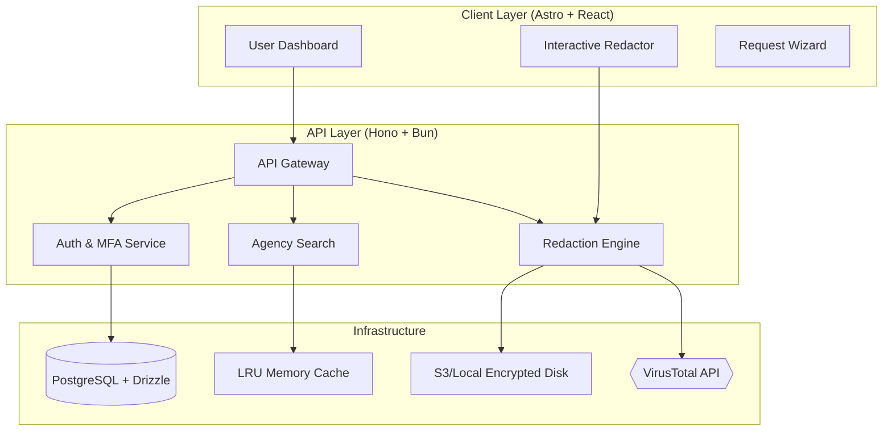
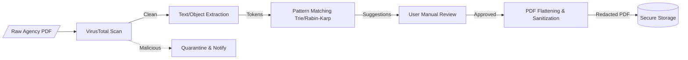

<!--
  Generated by AI-Powered README Generator
  Repository: https://github.com/FOIA-Stream/foia-stream
  Generated: 2026-01-07T07:15:50.754Z
  Format: md
  Style: comprehensive
-->

# 🏛️ FOIA Stream

**The Open-Source Command Center for Public Transparency and Records Management.**


## Table of Contents

- [Overview](#overview)
- [Features](#features)
- [Architecture](#architecture)
- [Quick Start](#quick-start)
- [Usage & Examples](#usage--examples)
- [Configuration](#configuration)
- [API Reference](#api-reference)
- [Development](#development)
- [Troubleshooting](#troubleshooting)
- [Contributing](#contributing)
- [Roadmap & Known Issues](#roadmap--known-issues)
- [License & Credits](#license--credits)

## Overview

**FOIA Stream** is a professional-grade, full-stack monorepo designed to automate the lifecycle of
Freedom of Information Act (FOIA) requests. Public records access is often hampered by bureaucratic
friction, fragmented tracking, and complex redaction requirements. This platform centralizes the
process into a high-performance "Command Center."

Built with a focus on speed and security, FOIA Stream leverages the **Bun** runtime and **Hono** web
framework for sub-millisecond API responses, while providing a modern, accessible interface through
**Astro** and **React**. It transforms the arduous task of records management into a streamlined,
auditable workflow.

**Who is this for?**
- 📰 **Investigative Journalists** managing massive document dumps and multiple agency deadlines.
- ⚖️ **Legal Advocates** requiring strict audit trails and statutory compliance tracking.
- 🏛️ **Government Agencies** seeking a modern interface for managing public record disclosures.
- 🛡️ **Transparency Activists** wanting to visualize agency responsiveness and compliance scores.

## Features

### 📋 Request Management
- ✨ **Smart Templates:** Pre-configured legal citations for local, state, and federal requests.
- ⚡ **Statutory Tracking:** Automated countdowns based on jurisdiction-specific legal deadlines.
- 🎯 **Multi-Agency Routing:** Send the same request to multiple agencies with one click.

### 🏢 Agency Intelligence
- 🔍 **Verified Directory:** Database of agency contacts and Records Access Officers (RAO).
- 📊 **Compliance Metrics:** Real-time scoring of agency responsiveness and fulfillment rates.
- 🏷️ **Jurisdiction Scoping:** Filters for Police, Education, Finance, and Executive branches.

### 🛡️ Document & Security
- 🖋️ **True Redaction:** Specialized engine that physically removes PII rather than masking it.
- 🤖 **AI-Assisted Detection:** Automated identification of SSNs, names, and addresses.
- 🦠 **Malware Protection:** Integrated VirusTotal scanning for all incoming agency responses.
- 🔒 **Encrypted Storage:** AES-256 encryption for private requests and sensitive documents.

## Architecture

FOIA Stream is organized as a **Turborepo** monorepo, ensuring strict type safety between the
frontend, backend, and shared utilities.

### System Components


### Data Flow: Document Ingestion & Redaction


### Technology Stack
| Layer | Technology | Purpose |
| :--- | :--- | :--- |
| **Runtime** | Bun | High-performance JS runtime & package manager |
| **Frontend** | Astro + React | Content-rich pages with interactive React islands |
| **Backend** | Hono | Lightweight, TypeScript-first web framework |
| **Database** | PostgreSQL | Relational data with Drizzle ORM |
| **Validation** | Zod | Schema validation across the entire stack |
| **Security** | Argon2 + Jose | Password hashing and JWT session management |

## Quick Start

### Prerequisites
- **Bun:** >= 1.1.0
- **Docker & Docker Compose:** For database and proxy services
- **VirusTotal API Key:** (Optional) For automated malware scanning

### Installation
```bash
# Clone the repository
git clone https://github.com/FOIA-Stream/foia-stream.git
cd foia-stream

# Install dependencies
bun install

# Configure environment (Edit .env files with your credentials)
cp apps/api/.env.example apps/api/.env
cp apps/astro/.env.example apps/astro/.env

# Start development environment (Postgres + API + Frontend)
docker-compose up -d
bun run dev
```

### Expected Output
The API will be available at `http://localhost:3000` and the Frontend at `http://localhost:4321`.
You should see a "Ready" message in the console indicating the Drizzle migrations are complete.

## Usage & Examples

### Creating a New FOIA Request
1.  **Select Agency:** Use the search bar to find the target jurisdiction.
2.  **Apply Template:** Choose "General Records Request" or "Police Incident Report."
3.  **Submit:** The system generates the PDF/Email and begins the statutory clock.

### API Usage Example (Programmatic Request)
```typescript
const response = await fetch('http://localhost:3000/api/v1/requests', {
  method: 'POST',
  headers: { 
    'Content-Type': 'application/json',
    'Authorization': 'Bearer <YOUR_TOKEN>' 
  },
  body: JSON.stringify({
    agencyId: "uuid-gov-123",
    subject: "Budget Allocations 2023",
    templateId: "standard-request",
    isPublic: true
  })
});

const data = await response.json();
console.log(`Request tracked with ID: ${data.id}`);
```

<details>
<summary>Advanced: Custom Redaction Patterns</summary>

You can extend the redaction engine by adding custom regex patterns to `packages/shared/src/utils/redacted.ts`. This allows you to target agency-specific ID formats or proprietary data structures.
</details>

## Configuration

### Environment Variables (API)
| Variable | Required | Default | Description |
| :--- | :--- | :--- | :--- |
| `DATABASE_URL` | Yes | - | PostgreSQL connection string |
| `JWT_SECRET` | Yes | - | Secret for signing session tokens |
| `VIRUSTOTAL_API_KEY`| No | - | API key for malware scanning |
| `PORT` | No | 3000 | Port for the Hono server |
| `NODE_ENV` | No | development | Runtime environment |

## API Reference

### Agencies API
`GET /api/v1/agencies`
- **Params:** `q` (search string), `limit`, `offset`
- **Returns:** Array of agency objects with RAO contact info.

### Redaction API
`POST /api/v1/redaction/analyze`
- **Body:** `File` (Multipart PDF)
- **Returns:** `BoundingBox[]` of suggested PII locations.

### Requests API
`PATCH /api/v1/requests/:id/status`
- **Body:** `{ "status": "fulfilled" | "denied" | "appealed" }`
- **Returns:** Updated request metadata.

## Development

### Project Structure
- `apps/api`: Hono backend, database schemas, and core services.
- `apps/astro`: Frontend pages and React UI components.
- `packages/shared`: Shared Zod schemas and heavy-lifting DSA (Trie, Rabin-Karp).
- `compliance/`: Documentation regarding PII handling and security controls.

### Running Tests
```bash
# Run unit tests for shared package
bun run test --filter=shared

# Run API integration tests
bun run test --filter=api

# Run E2E Cypress tests
bun run test:e2e --filter=astro
```

## Troubleshooting

| Error | Cause | Solution |
| :--- | :--- | :--- |
| `ECONNREFUSED 127.0.0.1:5432` | Postgres container not running | Run `docker-compose up -d postgres` |
| `Unexpected token in JSON` | API crashed or returned 500 | Check `docker logs foia-api` for stack traces |
| `Redaction engine timeout` | PDF is too large or complex | Increase `MAX_FILE_SIZE` in `apps/api/src/config/index.ts` |

## Contributing

We welcome contributions from journalists and developers alike.
1.  **Fork** the repository.
2.  **Create** a feature branch (`git checkout -b feature/amazing-feature`).
3.  **Commit** your changes using conventional commits (`feat: add auto-redaction`).
4.  **Push** to the branch and **Open a Pull Request**.

Please ensure you run `bun run lint` (using Biome) before submitting code.

## Roadmap & Known Issues

- [ ] 📅 Integration with Google Calendar for deadline alerts.
- [ ] ✉️ Direct SMTP integration for sending emails from the dashboard.
- [ ] 📱 Mobile application for capturing field documents.
- ⚠️ **Issue:** OCR performance is currently limited for handwritten documents.
- ⚠️ **Issue:** Multi-page PDF redaction (>100 pages) may require significant memory in the Bun runtime.

## License & Credits

- **License:** MIT - See [LICENSE](LICENSE) for details.
- **Maintainer:** FOIA Stream Core Team
- **Inspirations:** MuckRock, FOIA Machine, and the investigative journalism community.