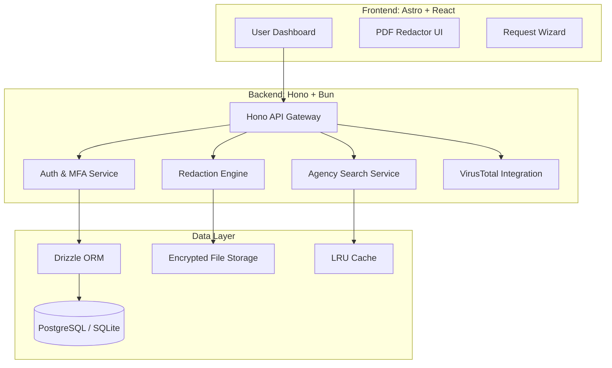
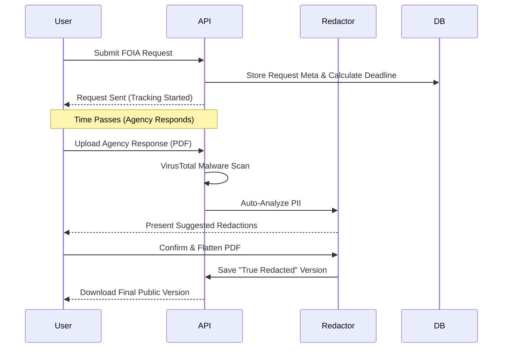

<!--
  Generated by AI-Powered README Generator
  Repository: https://github.com/FOIA-Stream/foia-stream
  Generated: 2026-01-03T04:08:29.026Z
  Format: md
  Style: comprehensive
-->

# 🏛️ FOIA Stream

> **The Open-Source Command Center for Public Transparency and Records Management.**

FOIA Stream is a high-performance, full-stack monorepo designed to automate the lifecycle of Freedom of Information Act (FOIA) requests. From drafting and routing to deadline tracking and secure, permanent redaction, it provides investigative journalists, legal advocates, and agencies with a professional-grade toolset for government accountability.


---

## 📑 Table of Contents

1.  [🔍 Overview](#-overview)
2.  [✨ Feature Highlights](#-feature-highlights)
3.  [🏗️ Architecture & Design](#️-architecture--design)
4.  [🚀 Getting Started](#-getting-started)
5.  [📖 Usage & Workflows](#-usage--workflows)
6.  [🛡️ Security & Compliance](#️-security--compliance)
7.  [🗺️ Roadmap & Limitations](#️-roadmap--limitations)
8.  [🛠️ Development & Contributing](#️-development--contributing)
9.  [📄 License & Credits](#-license--credits)
10. [❓ FAQ & Troubleshooting](#-faq--troubleshooting)

---

## 🔍 Overview

**FOIA Stream** solves the friction inherent in public records access. While the law guarantees access to information, the process is often hampered by bureaucratic delays, complex redaction requirements, and fragmented tracking.

### The Mission
To provide a centralized "Command Center" that professionalizes public records requests. FOIA Stream offers tools for investigative journalists, legal advocates, and concerned citizens to track government responsiveness in real-time and manage massive volumes of documents securely.

### Why FOIA Stream?
- **Unified Workflow:** Stop using spreadsheets. Track every request from draft to disclosure in one UI.
- **Agency Intelligence:** A built-in directory of verified agency contacts and compliance scores.
- **True Redaction:** Specialized engine that physically removes PII rather than just covering it with black boxes.
- **Performance First:** Built with Bun, Hono, and Astro for sub-millisecond API responses and lightning-fast page loads.

[Back to top ↑](#-table-of-contents)

---

## ✨ Feature Highlights

### 📋 Request & Template Management
- **Smart Templates:** Pre-configured legal templates for various request types (Police, Finance, Education).
- **Statutory Tracking:** Automated countdowns based on state-specific statutory response deadlines.
- **Status Dashboard:** Visual pipeline moving from `Draft` → `Submitted` → `Pending` → `Fulfilled`.

### 🏢 Agency & Jurisdiction Intelligence
- **Verified Directory:** Database of local, state, and federal agencies with direct contact info.
- **Multi-Agency Selector:** Send the same request to multiple jurisdictions simultaneously.
- **Compliance Metrics:** Publicly track which agencies are meeting legal deadlines.

### 🛡️ Secure Document Handling
- **High-Fidelity Redactor:** Interactive PDF viewer to manually or automatically redact sensitive data.
- **Auto-Redaction Engine:** AI-assisted detection of Names, SSNs, and addresses within documents.
- **Malware Scanning:** Integrated with VirusTotal to scan every incoming agency response.

> 💡 **Tip:** Use the **Agency Search** component to find the specific "Records Access Officer" (RAO) email, preventing your request from getting lost in a general "Contact Us" inbox.

[Back to top ↑](#-table-of-contents)

---

## 🏗️ Architecture & Design

FOIA Stream utilizes a **Turborepo** monorepo structure, optimized for the **Bun** runtime. This ensures unified type safety and extreme performance across the entire stack.

### System Architecture



### Core Request Lifecycle



### Technology Stack

| Layer | Technology | Purpose |
| :--- | :--- | :--- |
| **Runtime** | [Bun](https://bun.sh/) | Fast JavaScript all-in-one runtime & package manager. |
| **Frontend** | [Astro](https://astro.build/) | Content-focused web framework with React "Islands". |
| **Backend** | [Hono](https://hono.dev/) | Ultra-fast web framework for the API layer. |
| **ORM** | [Drizzle](https://orm.drizzle.team/) | Type-safe SQL interactions with zero overhead. |
| **Database** | [PostgreSQL](https://www.postgresql.org/) | Primary data store for production requests and logs. |
| **Styles** | [Tailwind CSS](https://tailwindcss.com/) | Utility-first styling for the entire dashboard. |
| **Lint/Format** | [Biome](https://biomejs.dev/) | High-performance toolchain replacing Prettier/ESLint. |

[Back to top ↑](#-table-of-contents)

---

## 🚀 Getting Started

### Prerequisites
- **Bun >= 1.1.0** (Recommended) or Node.js >= 20.x
- **Docker & Docker Compose** (For running PostgreSQL and Nginx)
- **VirusTotal API Key** (Optional, for document scanning)

### Local Installation

1. **Clone the repository:**
   ```bash
   git clone https://github.com/FOIA-Stream/foia-stream.git
   cd foia-stream
   ```

2. **Install dependencies:**
   ```bash
   bun install
   ```

3. **Configure Environment:**
   Create `.env` files for the API and Astro apps:
   ```bash
   cp apps/api/.env.example apps/api/.env
   cp apps/astro/.env.example apps/astro/.env
   ```

4. **Initialize Database:**
   ```bash
   bun run db:generate --filter=api
   bun run db:migrate --filter=api
   bun run db:seed --filter=api
   ```

### Docker Deployment (Recommended)

To run the entire stack (Postgres, API, Frontend) using Docker:

```bash
docker-compose up -d
```

🔍 **Troubleshooting Docker:** If you encounter issues, run the included diagnosis script:
```bash
./diagnose_docker.sh
```

[Back to top ↑](#-table-of-contents)

---

## 📖 Usage & Workflows

### 📂 Sending Your First Request
1.  Navigate to the **Requests** tab and click **New Request**.
2.  Use the **Agency Selector** to search for your target agency.
3.  Choose a **Template**. The system will populate your contact info and legal citations.
4.  Set the **Privacy Toggle**—decide if you want this request to be public on the FOIA Stream portal or private.
5.  Click **Send**. FOIA Stream tracks the 10, 20, or 30-day statutory clock automatically.

### ✂️ Professional Redaction Workflow
<details>
<summary><b>Click to expand Redaction Guide</b></summary>

1.  **Upload:** Go to the **Documents** section and upload the PDF received from the agency.
2.  **Scan:** The system automatically performs a VirusTotal scan to ensure the file is safe.
3.  **Analyze:** Click "Auto-Redact". The system uses the `auto-redaction.service.ts` to find names and addresses.
4.  **Review:** Manually adjust the bounding boxes in the UI.
5.  **Flatten:** Click "Physical Redaction". This triggers the `pdf-true-redaction.service` which re-renders the PDF, ensuring the data is physically gone from the file metadata.
</details>

[Back to top ↑](#-table-of-contents)

---

## 🛡️ Security & Compliance

FOIA Stream includes a dedicated `compliance/` suite to ensure data integrity and legal standards.

-   **PII Data Flow Analysis:** Detailed mapping of how Personally Identifiable Information is handled.
-   **True Redaction:** Unlike simple black-box overlays, FOIA Stream flattens PDFs to prevent data recovery via "select-all" or metadata scraping.
-   **Audit Logging:** Every action (request sent, document modified, user login) is stored in a cryptographically verifiable log.
-   **Security Scanning:** Automated ZAP (Zed Attack Proxy) rules are included in `.zap/` for API vulnerability testing.

| Security Feature | Implementation |
| :--- | :--- |
| **Auth** | Secure Session + MFA (Multi-Factor Authentication) |
| **Malware** | VirusTotal API scanning on all uploads |
| **Encryption** | AES-256 for sensitive request drafts |
| **Rate Limiting** | Integrated middleware to prevent brute-force and DDoS |

[Back to top ↑](#-table-of-contents)

---

## 🗺️ Roadmap & Limitations

### ⚠️ Current Limitations
- **OCR Support:** Currently, the redaction engine works best on text-based PDFs. Scanned images without OCR layers may require manual box drawing.
- **Mobile Support:** The redaction viewer is optimized for desktop (large screens) only.

### 🚀 Future Roadmap
- [ ] **AI-Powered OCR:** Integration with Tesseract/AWS Textract for scanned documents.
- [ ] **Mail Integration:** Direct SMTP/IMAP integration to send requests and receive responses within the app.
- [ ] **State-Specific Legal Logic:** Deeper automation for varying FOIA laws in all 50 US states.
- [ ] **Public API:** Allowing third-party transparency tools to query agency performance data.

[Back to top ↑](#-table-of-contents)

---

## 🛠️ Development & Contributing

We welcome contributions from developers, journalists, and legal experts!

### Scripts
- `bun run dev`: Start all apps in watch mode.
- `bun run build`: Build all apps for production.
- `bun run test`: Run the full Vitest suite for `api`, `astro`, and `shared` packages.
- `bun run lint`: Run Biome check for code style.

### Contribution Guidelines
1.  **Branching:** Use `feature/` or `fix/` prefixes.
2.  **Testing:** All new services must include a `.test.ts` file.
3.  **Types:** Ensure 100% type coverage—no `any` allowed.
4.  **Security:** Never commit `.env` files or hardcoded credentials.

[Back to top ↑](#-table-of-contents)

---

## 📄 License & Credits

### License
This project is licensed under the **MIT License**. See [LICENSE](LICENSE) for details.

### Acknowledgments
- **Hono** for the high-speed API foundation.
- **Astro** for the modern web architecture.
- **Drizzle ORM** for making SQL delightful.
- **The Transparency Community** for the legal templates and routing logic.

**Maintainer:** [FOIA-Stream Team](https://github.com/FOIA-Stream)

---

## ❓ FAQ & Troubleshooting

**Q: Why use Bun instead of Node?**
A: Bun's native SQLite support, faster startup times, and integrated test runner make it significantly more efficient for a monorepo of this scale.

**Q: The PDF Redactor is slow on large files.**
A: For files over 500 pages, we recommend using the `pdf-redaction.service` via CLI/API rather than the browser-based viewer to avoid memory exhaustion.

**Q: How do I update the Agency list?**
A: Run `bun run db:seed --filter=api` to refresh the agency database from the `seed-agencies.ts` source.

**Q: I'm getting a 413 "Payload Too Large" error.**
A: This is usually an Nginx restriction. Check `nginx.conf` and ensure `client_max_body_size` is set to accommodate large PDF uploads.

[Back to top ↑](#-table-of-contents)