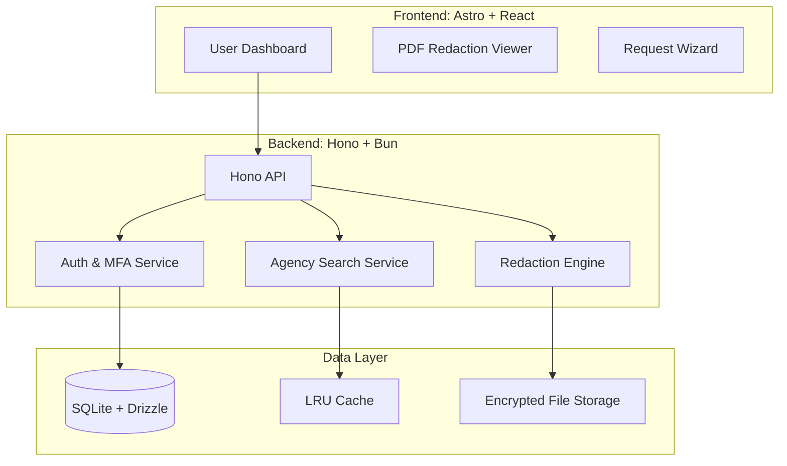
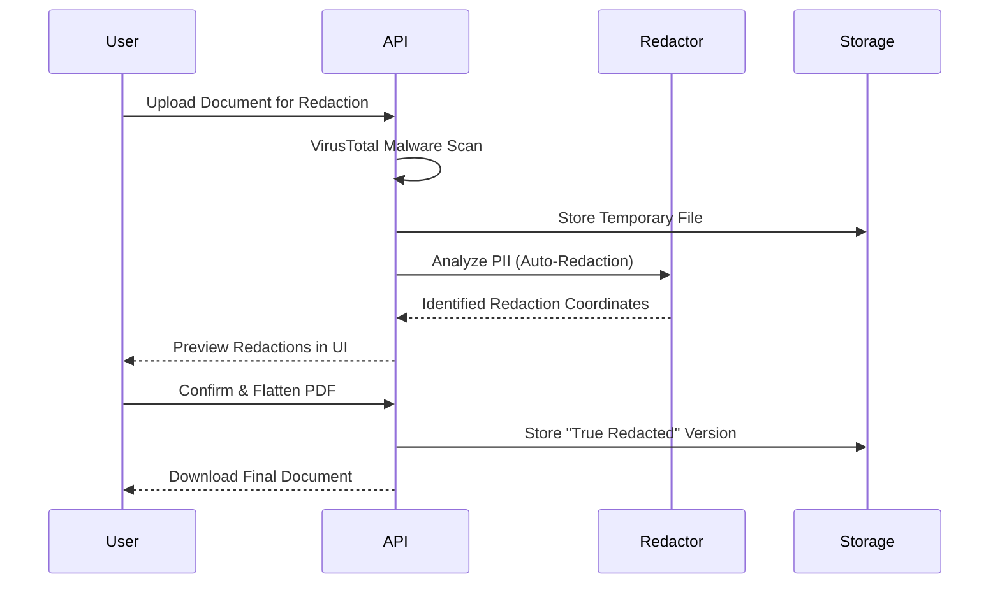

<!--
  Generated by AI-Powered README Generator
  Repository: https://github.com/FOIA-Stream/foia-stream
  Generated: 2025-12-30T08:23:06.858Z
  Format: md
  Style: comprehensive
-->

# 🏛️ FOIA Stream

> **Empowering Public Transparency through Automated Records Management and Agency Accountability.**

FOIA Stream is a high-performance, full-stack monorepo designed to bridge the gap between government agencies and the public. By automating the lifecycle of Freedom of Information Act (FOIA) requests—from drafting and jurisdiction routing to deadline tracking and secure document disclosure—it transforms a complex legal process into a streamlined, digital workflow.

[](#)
[](#)
[](#)
[](#)
[](#)
[](#)

---

## 📑 Table of Contents

- [🔍 Overview](#-overview)
- [✨ Feature Highlights](#-feature-highlights)
- [🏗️ Architecture & Design](#️-architecture--design)
- [🚀 Getting Started](#-getting-started)
- [📖 Usage & Workflows](#-usage--workflows)
- [🔐 Security & Compliance](#-security--compliance)
- [🗺️ Roadmap & Limitations](#️-roadmap--limitations)
- [🛠️ Development & Contributing](#️-development--contributing)
- [📄 License & Contact](#-license--contact)
- [❓ FAQ & Troubleshooting](#-faq--troubleshooting)

---

## 🔍 Overview

**FOIA Stream** is built on the belief that transparency is the bedrock of democracy. While the law mandates public access to records, the practical hurdles—missed deadlines, fragmented communication, and opaque filing systems—often render those rights inaccessible.

### The Mission
To provide a centralized "Command Center" that professionalizes public records requests. FOIA Stream offers tools for investigative journalists, legal advocates, and concerned citizens to track government responsiveness in real-time.

### Why FOIA Stream?
- **For Citizens:** Remove the guesswork. Use legally-vetted templates and automatic agency routing.
- **For Journalists:** Manage bulk requests across hundreds of jurisdictions with automated follow-ups.
- **For Agencies:** Manage high-volume disclosures with built-in redaction workflows and audit logs.

[Back to top ↑](#-table-of-contents)

---

## ✨ Feature Highlights

### 📋 Request Management
- **Smart Templates:** Pre-configured drafts for police body-cam footage, use-of-force reports, and financial audits.
- **Deadline Monitoring:** Automated countdowns based on state-specific statutory response times.
- **Status Dashboard:** Visual pipeline moving from `Draft` → `Submitted` → `In Progress` → `Fulfilled`.

### 🏢 Agency Intelligence
- **Verified Directory:** A searchable database of state and local agency contact information.
- **Compliance Scores:** Public-facing metrics on how quickly and thoroughly agencies respond.
- **Jurisdiction Mapping:** Automatic identification of the correct "Records Access Officer".

### 🛡️ Redaction & Security
- **PDF Redaction Engine:** High-fidelity document redaction that ensures "true" removal of sensitive metadata.
- **Auto-Redaction:** AI-assisted detection of PII (Names, SSNs, Addresses) within uploaded documents.
- **VirusTotal Integration:** Automated malware scanning for all incoming agency responses.

> 💡 **Tip:** Use the **Agency Search** component to find the specific "Records Access Officer" email, preventing your request from getting lost in a general "Contact Us" inbox.

[Back to top ↑](#-table-of-contents)

---

## 🏗️ Architecture & Design

FOIA Stream utilizes a **Turborepo** monorepo structure, optimized for the **Bun** runtime. This ensures unified type safety and extreme performance across the entire stack.

### System Component Diagram



### Core Request Processing Flow



### Technology Stack Breakdown

| Layer | Technology | Purpose |
| :--- | :--- | :--- |
| **Runtime** | [Bun](https://bun.sh/) | Fast JavaScript all-in-one runtime. |
| **Frontend** | [Astro](https://astro.build/) | Content-focused web framework for the landing and app shells. |
| **UI Components** | [React](https://reactjs.org/) | Interactive "islands" for dashboards and redaction tools. |
| **API** | [Hono](https://hono.dev/) | Ultrafast web framework for the API layer. |
| **ORM** | [Drizzle](https://orm.drizzle.team/) | Type-safe SQL interactions. |
| **Database** | [SQLite](https://sqlite.org/) | Local-first, portable database. |
| **Lint/Format** | [Biome](https://biomejs.dev/) | High-performance toolchain. |

[Back to top ↑](#-table-of-contents)

---

## 🚀 Getting Started

### Prerequisites
- **Bun >= 1.1.0**
- **SQLite 3**
- A [VirusTotal API Key](https://www.virustotal.com/) (Optional, for document scanning)

### Installation

1. **Clone the repository:**
   ```bash
   git clone https://github.com/FOIA-Stream/foia-stream.git
   cd foia-stream
   ```

2. **Install dependencies:**
   ```bash
   bun install
   ```

3. **Configure Environment:**
   ```bash
   cp apps/api/.env.example apps/api/.env
   ```
   Edit `apps/api/.env` to include your `DATABASE_URL` and `JWT_SECRET`.

4. **Initialize Database:**
   ```bash
   bun run db:generate --filter=api
   bun run db:migrate --filter=api
   bun run db:seed --filter=api
   ```

### Running the Application

| Environment | Command |
| :--- | :--- |
| **Development** | `bun run dev` |
| **Build** | `bun run build` |
| **Test** | `bun run test` |
| **Linting** | `bun run lint` |

[Back to top ↑](#-table-of-contents)

---

## 📖 Usage & Workflows

### Creating a FOIA Request
1. Navigate to the **Dashboard**.
2. Click **"New Request"**.
3. Use the **Agency Search** to find your target jurisdiction.
4. Select a **Template** (e.g., "General Records Request").
5. The system will automatically calculate the expected response date based on local laws.

### Document Redaction Workflow
<details>
<summary><b>View Redaction Steps</b></summary>

1. Upload your received PDF to the **Documents** section.
2. Open the **Redaction Viewer**.
3. Use the "Auto-Suggest" feature to highlight PII.
4. Manually draw boxes over any remaining sensitive info.
5. Click **"Flatten & Export"** to generate a clean PDF where the data is physically removed, not just hidden.
</details>

[Back to top ↑](#-table-of-contents)

---

## 🔐 Security & Compliance

FOIA Stream is built with strict privacy requirements to handle sensitive legal documents.

- **Encryption at Rest:** All uploaded records are encrypted using AES-256.
- **PII Protection:** Integrated logic for identifying and stripping Personally Identifiable Information.
- **Audit Logs:** Every action (view, download, redact) is logged for chain-of-custody verification.
- **Compliance Documentation:** See the `/compliance` directory for Data Retention Policies and Privacy Impact Assessments.

⚠️ **Warning:** Never upload unredacted documents to a public server without verifying your instance's encryption settings.

[Back to top ↑](#-table-of-contents)

---

## 🗺️ Roadmap & Limitations

### Current Limitations
- **File Format:** True Redaction currently supports PDF format only.
- **Search:** Agency directory is currently limited to US-based agencies.

### Future Enhancements
- [ ] **OCR Integration:** Automatically convert scanned image-PDFs into searchable text.
- [ ] **Email Integration:** Direct IMAP/SMTP sync to receive agency responses inside the platform.
- [ ] **Collaboration:** Multi-user workspaces for newsrooms and legal teams.

[Back to top ↑](#-table-of-contents)

---

## 🛠️ Development & Contributing

We welcome contributions from developers, legal experts, and transparency advocates!

### Standards
- **Coding Style:** We use [Biome](https://biomejs.dev/) for linting and formatting. Run `bun run lint:fix` before committing.
- **Testing:** 100% type safety is required. All new features must include Vitest units or Cypress E2E tests.

### PR Guidelines
1. Branch from `main` using `feat/` or `fix/` prefixes.
2. Ensure `bun run test` passes.
3. Update the `CHANGELOG.md` if applicable.

[Back to top ↑](#-table-of-contents)

---

## ❓ FAQ & Troubleshooting

**Q: Why use Bun instead of Node.js?**
A: FOIA Stream processes large PDF binaries and high volumes of request data. Bun's native SQLite support and faster startup times significantly reduce latency in the redaction pipeline.

**Q: Is my data safe on a self-hosted instance?**
A: Yes. FOIA Stream is designed for privacy. By self-hosting, you retain 100% ownership of your documents and database.

**Q: The PDF Redactor isn't loading.**
A: Ensure your browser supports WebAssembly (WASM) and check that `pdf.worker.min.mjs` is correctly served from the `/public` directory.

---

## 📄 License & Contact

- **License:** MIT License. See [LICENSE](LICENSE) for details.
- **Maintainer:** [FOIA Stream Team](https://github.com/FOIA-Stream)
- **Security Issues:** Please report security vulnerabilities to `security@foiastream.org`.

---
*Built with ❤️ for the Freedom of Information community.*