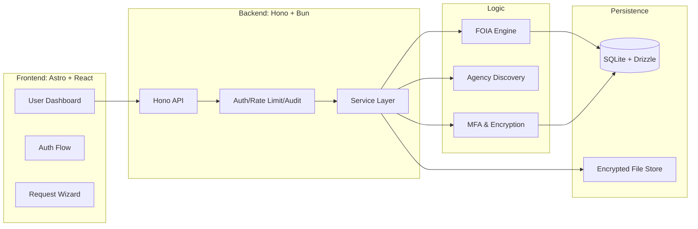
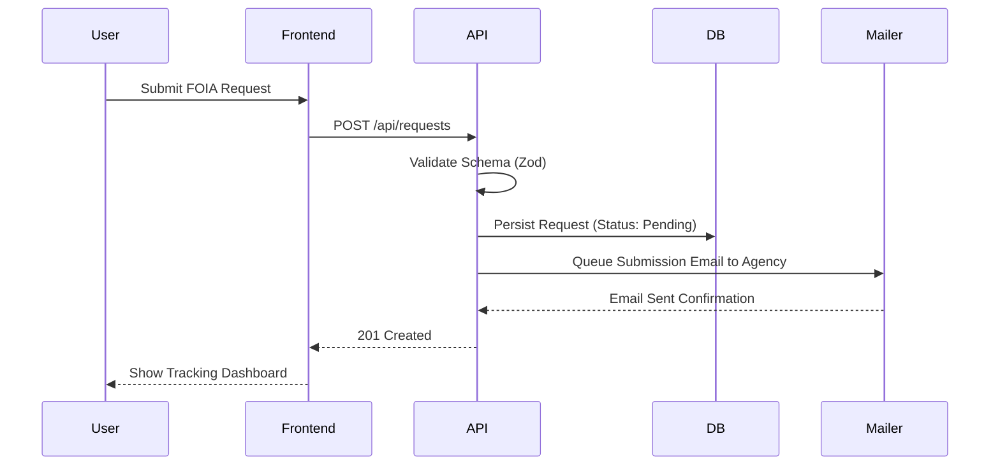

<!--
  Copyright (c) 2025 Foia Stream

  Permission is hereby granted, free of charge, to any person obtaining a copy
  of this software and associated documentation files (the "Software"), to deal
  in the Software without restriction, including without limitation the rights
  to use, copy, modify, merge, publish, distribute, sublicense, and/or sell
  copies of the Software, and to permit persons to whom the Software is
  furnished to do so, subject to the following conditions:

  The above copyright notice and this permission notice shall be included in all
  copies or substantial portions of the Software.

  THE SOFTWARE IS PROVIDED "AS IS", WITHOUT WARRANTY OF ANY KIND, EXPRESS OR
  IMPLIED, INCLUDING BUT NOT LIMITED TO THE WARRANTIES OF MERCHANTABILITY,
  FITNESS FOR A PARTICULAR PURPOSE AND NONINFRINGEMENT. IN NO EVENT SHALL THE
  AUTHORS OR COPYRIGHT HOLDERS BE LIABLE FOR ANY CLAIM, DAMAGES OR OTHER
  LIABILITY, WHETHER IN AN ACTION OF CONTRACT, TORT OR OTHERWISE, ARISING FROM,
  OUT OF OR IN CONNECTION WITH THE SOFTWARE OR THE USE OR OTHER DEALINGS IN THE
  SOFTWARE.
-->

<!--
  Generated by AI-Powered README Generator
  Repository: https://github.com/WomB0ComB0/foia-stream
  Generated: 2025-12-26T03:02:48.379Z
  Format: md
  Style: comprehensive
-->

# 🏛️ FOIA Stream

> **Empowering Public Transparency through Automated Records Management and Agency Accountability.**

FOIA Stream is a high-performance, full-stack monorepo designed to bridge the gap between government agencies and the public. By automating the lifecycle of Freedom of Information Act (FOIA) requests—from drafting and jurisdiction routing to deadline tracking and secure document disclosure—it transforms a complex legal process into a streamlined, digital workflow.


---

## 📑 Table of Contents

- [🔍 Overview](#-overview)
- [✨ Feature Highlights](#-feature-highlights)
- [🏗️ Architecture & Design](#️-architecture--design)
- [🚀 Getting Started](#-getting-started)
- [📖 Usage & Workflows](#-usage--workflows)
- [🔐 Security & Compliance](#-security--compliance)
- [🛠️ Development & Contributing](#️-development--contributing)
- [🗺️ Roadmap & Limitations](#️-roadmap--limitations)
- [📄 License & Contact](#-license--contact)
- [❓ FAQ & Troubleshooting](#-faq--troubleshooting)

---

## 🔍 Overview

**FOIA Stream** is built on the belief that transparency is the bedrock of democracy. While the law mandates public access to records, the practical hurdles—missed deadlines, fragmented communication, and opaque filing systems—often render those rights inaccessible.

### The Mission
To provide a centralized "Command Center" that professionalizes public records requests. FOIA Stream offers tools for investigative journalists, legal advocates, and concerned citizens to track government responsiveness in real-time.

### Why FOIA Stream?
- **For Citizens:** Remove the guesswork. Use legally-vetted templates and automatic agency routing.
- **For Journalists:** Manage bulk requests across hundreds of jurisdictions with automated follow-ups.
- **For Agencies:** (Optional Portal) Manage high-volume disclosures with built-in redaction workflows and audit logs.

[Back to top ↑](#-table-of-contents)

---

## ✨ Feature Highlights

### 📋 Request Management
- **Smart Templates:** Pre-configured drafts for police body-cam footage, use-of-force reports, and financial audits.
- **Deadline Monitoring:** Automated countdowns based on state-specific statutory response times (e.g., 5-day or 20-day limits).
- **Status Dashboard:** Visual pipeline moving from `Draft` → `Submitted` → `In Progress` → `Fulfilled/Denied`.

### 🏢 Agency Intelligence
- **Verified Directory:** A searchable database of state and local agency contact information.
- **Compliance Scores:** Public-facing metrics on how quickly and thoroughly agencies respond to requests.
- **Jurisdiction Mapping:** Automatic identification of the correct "Records Access Officer" for your specific location.

### 🛡️ Security & Privacy
- **Encrypted Storage:** Field-level encryption for sensitive requester data and retrieved documents.
- **MFA Ready:** Integrated Multi-Factor Authentication via TOTP.
- **Data Retention:** Automated purging of sensitive data based on configurable privacy policies.

> 💡 **Tip:** Use the **Agency Search** component to find the specific "Records Access Officer" email, preventing your request from getting lost in a general "Contact Us" inbox.

[Back to top ↑](#-table-of-contents)

---

## 🏗️ Architecture & Design

FOIA Stream utilizes a **Turborepo** monorepo structure, optimized for the **Bun** runtime. This ensures unified type safety across the entire stack.

### System Architecture



### Core Request Flow



### Technology Stack

| Component | Technology | Description |
| :--- | :--- | :--- |
| **Runtime** | [Bun](https://bun.sh/) | Fast JavaScript all-in-one runtime and package manager. |
| **Frontend** | [Astro](https://astro.build/) | Content-focused web framework with React islands. |
| **API** | [Hono](https://hono.dev/) | Ultrafast web framework for the edges. |
| **Database** | [Drizzle ORM](https://orm.drizzle.team/) | TypeScript ORM for SQLite. |
| **Validation** | [Zod](https://zod.dev/) | Schema-first validation for API and shared types. |
| **Style** | [Tailwind CSS](https://tailwindcss.com/) | Utility-first CSS framework. |
| **Linter** | [Biome](https://biomejs.dev/) | High-performance toolchain for web projects. |

[Back to top ↑](#-table-of-contents)

---

## 🚀 Getting Started

### Prerequisites
- **Bun >= 1.0.0** (Install via `curl -fsSL https://bun.sh/install | bash`)
- **SQLite 3**

### Installation

1. **Clone & Install:**
   ```bash
   git clone https://github.com/WomB0ComB0/foia-stream.git
   cd foia-stream
   bun install
   ```

2. **Environment Configuration:**
   Copy the example environment file and fill in your secrets.
   ```bash
   cp apps/api/.env.example apps/api/.env
   # Update variables in apps/api/.env and apps/astro/.env
   ```

3. **Database Migration:**
   Initialize your local SQLite database using Drizzle.
   ```bash
   bun run db:generate --filter=api
   bun run db:push --filter=api
   ```

4. **Seed Initial Data:**
   Populate the agency directory and templates.
   ```bash
   bun run db:seed --filter=api
   ```

### Running the Application

| Command | Action |
| :--- | :--- |
| `bun run dev` | Starts both API and Astro frontend in parallel via Turbo. |
| `bun run build` | Compiles the entire monorepo for production. |
| `bun run test` | Executes the Vitest suite across all packages. |
| `bun run lint` | Runs Biome for formatting and linting check. |

[Back to top ↑](#-table-of-contents)

---

## 📖 Usage & Workflows

### 1. Creating a Request
1. Navigate to the **Dashboard**.
2. Click **New Request**.
3. Search for an **Agency** (e.g., "Chicago PD").
4. Select a **Template** (e.g., "Standard Records Request").
5. Review the auto-generated legal text and click **Submit**.

### 2. Managing Documents
The Document Viewer supports inline PDF viewing and redaction verification.
```typescript
// Example: Fetching request details via the API
const response = await fetch('/api/requests/req_12345', {
  headers: { 'Authorization': `Bearer ${token}` }
});
const data = await response.json();
console.log(data.status); // "Fulfillment_In_Progress"
```

### 3. Redaction Workflow
<details>
<summary><b>View Redaction Process</b></summary>

The system includes a `pdf-redaction.service.ts` that uses `pdf-lib` to overlay black boxes on sensitive coordinates before public disclosure.
1. Upload Document.
2. Select text/areas for redaction.
3. Service generates a "Sanitized" version.
4. Audit log records who performed the redaction and why.
</details>

[Back to top ↑](#-table-of-contents)

---

## 🔐 Security & Compliance

FOIA Stream is designed with strict data handling policies, as detailed in our `/compliance` directory.

- **PII Protection:** All Personally Identifiable Information is encrypted at rest using AES-256-GCM.
- **Rate Limiting:** Built-in Hono middleware prevents scraping or brute-force attacks on agency endpoints.
- **Audit Logging:** Every interaction with a record is timestamped and attributed to a specific user ID.
- **Compliance Documentation:** 
  - [Data Retention Policy](./compliance/privacy/data-retention-policy.md)
  - [Privacy Impact Assessment](./compliance/privacy/privacy-impact-assessment.md)
  - [Incident Response Runbook](./compliance/runbooks/incident-response.md)

⚠️ **Warning:** Ensure you rotate the `ENCRYPTION_SECRET` in your `.env` before deploying to a production environment.

[Back to top ↑](#-table-of-contents)

---

## 🛠️ Development & Contributing

We welcome contributions from developers, legal experts, and UI designers.

### Project Structure
- `apps/api`: Hono backend with Drizzle/SQLite.
- `apps/astro`: Astro frontend with React islands.
- `packages/shared`: Shared Zod schemas and utility functions.
- `compliance/`: Legal frameworks and security policies.

### Contribution Rules
1. **Branching:** Use `feature/` or `fix/` prefixes.
2. **Linting:** Run `bun run lint:fix` before committing.
3. **Testing:** Ensure `bun run test` passes for all changed packages.
4. **Documentation:** Update relevant `.md` files if adding new features.

[Back to top ↑](#-table-of-contents)

---

## 🗺️ Roadmap & Limitations

### Current Limitations
- ⚠️ **Email Integration:** Currently requires a manual SMTP setup for automated agency dispatching.
- ⚠️ **File Size:** Uploads are limited to 50MB per document in the default configuration.

### Future Enhancements
- [ ] **AI-Powered Extraction:** Automatically extract entities (dates, names, dollar amounts) from disclosed PDFs.
- [ ] **State-Specific Statutes:** Integration of all 50 US state FOIA response laws.
- [ ] **Mobile App:** React Native companion app for on-the-go request tracking.
- [ ] **Public API:** GraphQL interface for third-party transparency tools.

[Back to top ↑](#-table-of-contents)

---

## 📄 License & Contact

Distributed under the **MIT License**. See `LICENSE` for more information.

**Project Lead:** [WomB0ComB0](https://github.com/WomB0ComB0)  
**Security Contact:** security@foia-stream.org  

---

## ❓ FAQ & Troubleshooting

### FAQ
**Q: Does this work with federal FOIA.gov?**  
A: Yes, FOIA Stream can be used to track federal requests, though direct API integration with FOIA.gov is planned for v1.2.

**Q: Can I use PostgreSQL instead of SQLite?**  
A: While Drizzle supports it, the current schema is optimized for SQLite. You would need to update `drizzle.config.ts` and the driver in `db/index.ts`.

### Troubleshooting
| Issue | Solution |
| :--- | :--- |
| **Drizzle Migration Fails** | Delete the `./data/foia-stream.db` and re-run `db:push`. |
| **Hydration Errors** | Ensure React components in Astro are marked with `client:load` or `client:visible`. |
| **Bun Type Errors** | Run `bun add -d @types/bun` to sync global types. |

---
*Built with ❤️ for the Open Government community.*