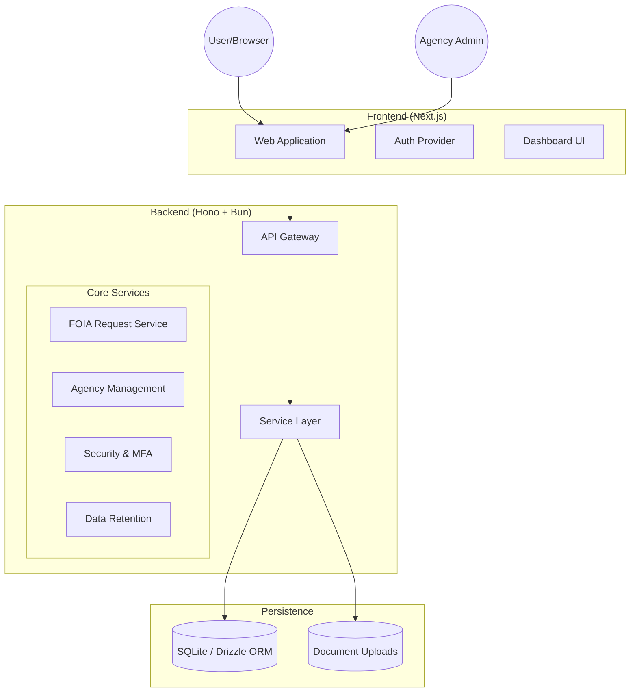
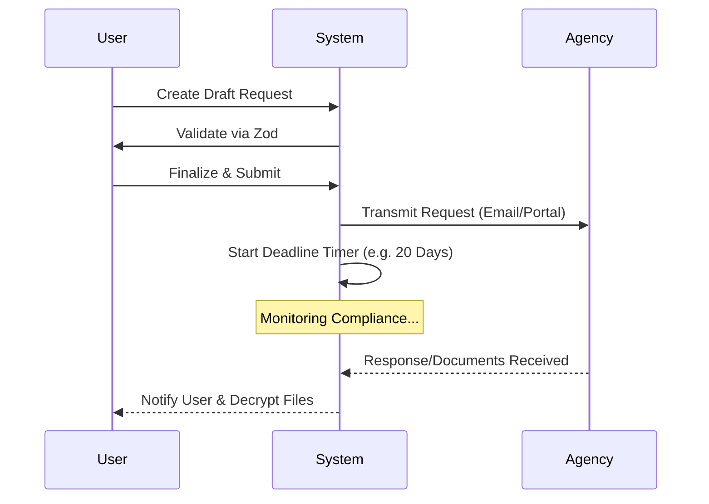

<!--
  Generated by AI-Powered README Generator
  Repository: https://github.com/WomB0ComB0/foia-stream
  Generated: 2025-12-23T23:57:30.215Z
  Format: md
  Style: comprehensive
-->

# 🏛️ FOIA Stream

> **Transparency and Audit Application for Public Records Requests**

FOIA Stream bridges the gap between law-enforcement agencies and civilians by making public-records requests simple, automating disclosure, and centralizing information. The platform increases accountability and rebuilds trust through professional-grade transparency tools.


---

## 📑 Table of Contents

- [🔍 Overview](#-overview)
- [✨ Feature Highlights](#-feature-highlights)
- [🏗️ Architecture & Design](#️-architecture--design)
- [🚀 Getting Started](#-getting-started)
- [📖 Usage & Workflows](#-usage--workflows)
- [🔐 Security & Compliance](#-security--compliance)
- [🛠️ Development & Contributing](#️-development--contributing)
- [🗺️ Roadmap & Limitations](#️-roadmap--limitations)
- [📄 License & Contact](#-license--contact)
- [❓ FAQ & Troubleshooting](#-faq--troubleshooting)

---

## 🔍 Overview

**FOIA Stream** is a comprehensive solution designed to streamline the Freedom of Information Act (FOIA) request process. While the legal right to public records exists, the technical and bureaucratic hurdles often prevent effective oversight. 

### The Problem
- **Fragmentation:** Requests are scattered across emails, portals, and physical mail.
- **Opaque Deadlines:** Agencies often miss legal deadlines without easy ways for citizens to track compliance.
- **Complexity:** Drafting legally sound requests requires specific language and knowledge of jurisdictions.

### The Solution
FOIA Stream provides a centralized "Command Center" for both the public and agencies. It automates the generation of request templates, tracks statutory deadlines, and generates public compliance scores for government entities, ensuring that transparency is not just a right, but a functional reality.

**Target Audience:** 
- 🕵️ **Journalists & Researchers:** For bulk data collection and longitudinal studies.
- ⚖️ **Attorneys & Advocates:** For gathering evidence and monitoring policy compliance.
- 👤 **Civilians:** For accessing personal records or local agency data easily.
- 🏛️ **Agency Officials:** For managing high volumes of requests with automated workflows.

[Back to top ↑](#-table-of-contents)

---

## ✨ Feature Highlights

### 📝 Submission & Tracking
- **Request Wizard:** Step-by-step guidance to ensure requests are sent to the correct jurisdiction.
- **Smart Templates:** Pre-built templates for body-cam footage, use-of-force reports, and departmental policies.
- **Status Dashboard:** Real-time tracking of "Draft," "Submitted," "Pending," and "Fulfilled" states.

### 🏛️ Agency Intelligence
- **Global Agency Directory:** Comprehensive database of contact info for federal, state, and local agencies.
- **Compliance Metrics:** Automated tracking of response times and denial rates.
- **Jurisdiction Routing:** Automatically maps your request to the appropriate governing body.

### 🛡️ Enterprise-Grade Security
- **MFA & Encryption:** Secure multi-factor authentication and field-level encryption for sensitive documents.
- **Audit Logging:** Every action is logged to maintain a chain of custody for records.
- **Data Retention:** Automated policies to ensure compliance with privacy laws (GDPR/CCPA/FOIA-specific).

> 💡 **Tip:** Use the "Official Templates" section to increase the likelihood of request fulfillment by using legally-vetted language.

[Back to top ↑](#-table-of-contents)

---

## 🏗️ Architecture & Design

FOIA Stream is built as a modern monorepo using **Turborepo**, ensuring tight integration between the API, Web frontend, and shared packages.

### Component Diagram



### Technology Stack breakdown

| Layer | Technology | Purpose |
| :--- | :--- | :--- |
| **Runtime** | [Bun](https://bun.sh/) | Ultra-fast JS runtime and package manager |
| **API** | [Hono](https://hono.dev/) | Lightweight, edge-compatible web framework |
| **Frontend** | [Next.js](https://nextjs.org/) | React framework for the dashboard and public site |
| **Database** | [Drizzle ORM](https://orm.drizzle.team/) | Type-safe SQL interaction with SQLite |
| **Validation** | [Zod](https://zod.dev/) | Schema validation for API and Forms |
| **Styling** | [Tailwind CSS](https://tailwindcss.com/) | Utility-first CSS for the UI |

[Back to top ↑](#-table-of-contents)

---

## 🚀 Getting Started

### Prerequisites
- **Bun >= 1.0.0** (Required for the runtime and workspace management)
- **Node.js** (Optional, for specific legacy tooling)
- **SQLite3**

### Installation

1. **Clone the repository:**
   ```bash
   git clone https://github.com/WomB0ComB0/foia-stream.git
   cd foia-stream
   ```

2. **Install dependencies:**
   ```bash
   bun install
   ```

3. **Environment Setup:**
   Copy the example environment files in both the root and apps.
   ```bash
   cp .env.example .env
   cp apps/api/.env.example apps/api/.env
   cp apps/web/.env.example apps/web/.env
   ```

4. **Initialize Database:**
   ```bash
   bun run db:push --filter=api
   ```

### Running the Application

**Development Mode:**
```bash
bun run dev
```
This will start the API on `http://localhost:3000` and the Web UI on `http://localhost:3001`.

**Production Build:**
```bash
bun run build
bun run start
```

[Back to top ↑](#-table-of-contents)

---

## 📖 Usage & Workflows

### Creating a FOIA Request

1. **Navigate to "New Request":** Choose a template (e.g., "Standard Police Records").
2. **Select Agency:** Search our database for the local or state agency.
3. **Customize Fields:** Fill in dates, incident numbers, or specific officer names.
4. **Submit:** The system generates a PDF/Email and tracks the statutory response window.

### Request Lifecycle



### CLI & API Examples

<details>
<summary><b>View API Endpoints Reference</b></summary>

#### Authentication
- `POST /api/v1/auth/register` - New user signup
- `POST /api/v1/auth/login` - Get JWT token

#### Requests
- `GET /api/v1/requests` - List public requests
- `POST /api/v1/requests` - Create a new request
- `PATCH /api/v1/requests/:id/withdraw` - Cancel a request

#### Agencies
- `GET /api/v1/agencies` - Search agency database
- `GET /api/v1/agencies/:id/stats` - Get response time statistics

</details>

[Back to top ↑](#-table-of-contents)

---

## 🔐 Security & Compliance

FOIA Stream is built with a "Security-First" mindset, essential for handling sensitive legal documents.

- **🔍 Encryption:** At-rest encryption for all uploaded documents using AES-256.
- **⚠️ Rate Limiting:** Advanced middleware to prevent brute force and scraping.
- **✅ MFA:** Support for TOTP-based Multi-Factor Authentication.
- **💡 CIDR Banlists:** Built-in services to block malicious actors at the infrastructure level.

### Compliance Documentation
The `/compliance` directory contains exhaustive documentation on:
- **Data Retention Policy:** How long we keep records.
- **Privacy Impact Assessment:** Analysis of user data safety.
- **Incident Response:** Runbooks for potential security events.

[Back to top ↑](#-table-of-contents)

---

## 🗺️ Roadmap & Limitations

### Current Limitations
- **Manual Transmission:** Some agencies still require manual email sending or physical mail (Automation in progress).
- **SQLite:** Current implementation uses SQLite, which is excellent for edge/local use but requires migration to Postgres for massive horizontal scaling.

### Future Roadmap
- [ ] **Automated Follow-ups:** Automatically send "friendly reminders" when legal deadlines are missed.
- [ ] **AI-Powered Redaction:** Helper tools to suggest redactions for PII (Personally Identifiable Information).
- [ ] **Mobile App:** React Native application for on-the-go request filing.
- [ ] **Public API for Data Journalists:** Streamlined access to agency compliance data.

[Back to top ↑](#-table-of-contents)

---

## 🛠️ Development & Contributing

We welcome contributions from the community!

### Standards
- **Linting:** We use [Biome](https://biomejs.dev/) for lightning-fast linting and formatting.
- **Testing:** Vitest is used for unit and integration tests.
- **Branching:** Please use `feature/` or `fix/` prefixes for your branches.

### Development Commands
```bash
bun run lint          # Check code quality
bun run test          # Run test suite
bun run db:studio     # Visual interface for the database
```

[Back to top ↑](#-table-of-contents)

---

## ❓ FAQ & Troubleshooting

**Q: Can I host this myself?**
A: Yes! FOIA Stream is designed to be self-hosted. Ensure you have a persistent volume for the SQLite database and uploads.

**Q: Does this work for federal FOIA requests?**
A: Yes, though federal requests often require submission through FOIA.gov. We provide the templates and tracking even if the submission happens externally.

**⚠️ Troubleshooting:**
- **Database Errors:** If you see "Table not found," ensure you have run `bun run db:push`.
- **Auth Failures:** Check that your `JWT_SECRET` in `.env` is at least 32 characters long.

---

## 📄 License & Contact

**License:** Distributed under the MIT License. See `LICENSE` for more information.

**Maintainer:** [WomB0ComB0](https://github.com/WomB0ComB0)  
**Project Link:** [https://github.com/WomB0ComB0/foia-stream](https://github.com/WomB0ComB0/foia-stream)

> Built with ⚖️ for a more transparent future.

[Back to top ↑](#-table-of-contents)