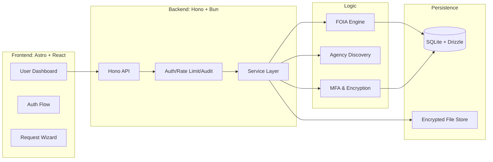
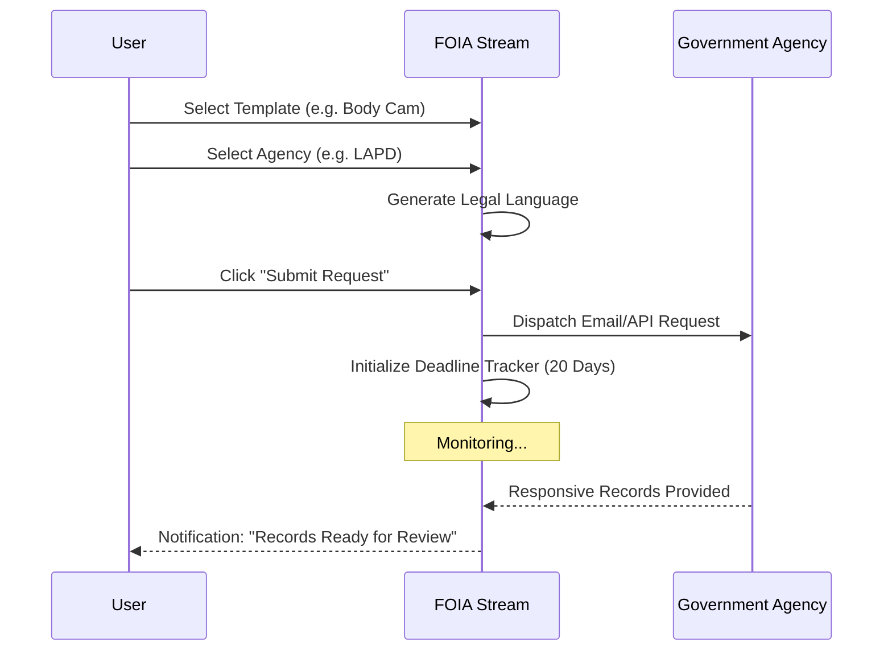

<!--
  Copyright (c) 2025 Foia Stream

  Permission is hereby granted, free of charge, to any person obtaining a copy
  of this software and associated documentation files (the "Software"), to deal
  in the Software without restriction, including without limitation the rights
  to use, copy, modify, merge, publish, distribute, sublicense, and/or sell
  copies of the Software, and to permit persons to whom the Software is
  furnished to do so, subject to the following conditions:

  The above copyright notice and this permission notice shall be included in all
  copies or substantial portions of the Software.

  THE SOFTWARE IS PROVIDED "AS IS", WITHOUT WARRANTY OF ANY KIND, EXPRESS OR
  IMPLIED, INCLUDING BUT NOT LIMITED TO THE WARRANTIES OF MERCHANTABILITY,
  FITNESS FOR A PARTICULAR PURPOSE AND NONINFRINGEMENT. IN NO EVENT SHALL THE
  AUTHORS OR COPYRIGHT HOLDERS BE LIABLE FOR ANY CLAIM, DAMAGES OR OTHER
  LIABILITY, WHETHER IN AN ACTION OF CONTRACT, TORT OR OTHERWISE, ARISING FROM,
  OUT OF OR IN CONNECTION WITH THE SOFTWARE OR THE USE OR OTHER DEALINGS IN THE
  SOFTWARE.
-->

<!--
  Generated by AI-Powered README Generator
  Repository: https://github.com/WomB0ComB0/foia-stream
  Generated: 2025-12-25T02:23:02.364Z
  Format: md
  Style: comprehensive
-->

# 🏛️ FOIA Stream

> **Empowering Public Transparency through Automated Records Management and Agency Accountability.**

FOIA Stream is a high-performance, full-stack monorepo designed to bridge the gap between government agencies and the public. By automating the lifecycle of Freedom of Information Act (FOIA) requests—from drafting and jurisdiction routing to deadline tracking and secure document disclosure—it transforms a complex legal process into a streamlined, digital workflow.


---

## 📑 Table of Contents

- [🔍 Overview](#-overview)
- [✨ Feature Highlights](#-feature-highlights)
- [🏗️ Architecture & Design](#️-architecture--design)
- [🚀 Getting Started](#-getting-started)
- [📖 Usage & Workflows](#-usage--workflows)
- [🔐 Security & Compliance](#-security--compliance)
- [🛠️ Development & Contributing](#️-development--contributing)
- [🗺️ Roadmap & Limitations](#️-roadmap--limitations)
- [📄 License & Contact](#-license--contact)
- [❓ FAQ & Troubleshooting](#-faq--troubleshooting)

---

## 🔍 Overview

**FOIA Stream** is built on the belief that transparency is the bedrock of democracy. While the law mandates public access to records, the practical hurdles—missed deadlines, fragmented communication, and opaque filing systems—often render those rights inaccessible.

### The Mission
To provide a centralized "Command Center" that professionalizes public records requests. FOIA Stream offers tools for investigative journalists, legal advocates, and concerned citizens to track government responsiveness in real-time.

### Why FOIA Stream?
- **For Citizens:** Remove the guesswork. Use legally-vetted templates and automatic agency routing.
- **For Journalists:** Manage bulk requests across hundreds of jurisdictions with automated follow-ups.
- **For Agencies:** (Optional Portal) Manage high-volume disclosures with built-in redaction workflows and audit logs.

[Back to top ↑](#-table-of-contents)

---

## ✨ Feature Highlights

### 📋 Request Management
- **Smart Templates:** Pre-configured drafts for police body-cam footage, use-of-force reports, and financial audits.
- **Deadline Monitoring:** Automated countdowns based on state-specific statutory response times (e.g., 5-day or 20-day limits).
- **Status Dashboard:** Visual pipeline moving from `Draft` → `Submitted` → `In Progress` → `Fulfilled/Denied`.

### 🏢 Agency Intelligence
- **Verified Directory:** A searchable database of state and local agency contact information.
- **Compliance Scores:** Public-facing metrics on how quickly and thoroughly agencies respond to requests.
- **Jurisdiction Mapping:** Automatic identification of the correct "Records Access Officer" for your specific location.

### 🛡️ Security & Privacy
- **Encrypted Storage:** Field-level encryption for sensitive requester data and retrieved documents.
- **MFA Ready:** Integrated Multi-Factor Authentication via TOTP.
- **Data Retention:** Automated purging of sensitive data based on configurable privacy policies.

> 💡 **Tip:** Use the **Agency Search** component to find the specific "Records Access Officer" email, preventing your request from getting lost in a general "Contact Us" inbox.

[Back to top ↑](#-table-of-contents)

---

## 🏗️ Architecture & Design

FOIA Stream utilizes a **Turborepo** monorepo structure, optimized for the **Bun** runtime. This ensures unified type safety across the entire stack.

### System Architecture



### Technology Stack breakdown

| Component | Technology | Description |
| :--- | :--- | :--- |
| **Runtime** | [Bun](https://bun.sh/) | Fast JavaScript all-in-one runtime and package manager. |
| **Frontend** | [Astro](https://astro.build/) | Content-focused web framework with React islands. |
| **API** | [Hono](https://hono.dev/) | Ultrafast web framework for the edges. |
| **Database** | [Drizzle ORM](https://orm.drizzle.team/) | TypeScript ORM for SQLite. |
| **Validation** | [Zod](https://zod.dev/) | Schema-first validation for API and shared types. |
| **Style** | [Tailwind CSS](https://tailwindcss.com/) | Utility-first CSS framework. |
| **Linter** | [Biome](https://biomejs.dev/) | High-performance toolchain for web projects. |

[Back to top ↑](#-table-of-contents)

---

## 🚀 Getting Started

### Prerequisites
- **Bun >= 1.0.0** (Install via `curl -fsSL https://bun.sh/install | bash`)
- **SQLite 3**

### Installation

1. **Clone & Install:**
   ```bash
   git clone https://github.com/WomB0ComB0/foia-stream.git
   cd foia-stream
   bun install
   ```

2. **Environment Configuration:**
   Copy the example environment file and fill in your secrets.
   ```bash
   cp .env.example .env
   # Also check apps/api/.env and apps/astro/.env
   ```

3. **Database Migration:**
   Initialize your local SQLite database using Drizzle.
   ```bash
   bun run db:generate --filter=api
   bun run db:push --filter=api
   ```

4. **Seed Initial Data:**
   Populate the agency directory and templates.
   ```bash
   bun run db:seed --filter=api
   ```

### Running the Application

| Command | Action |
| :--- | :--- |
| `bun run dev` | Starts both API and Astro frontend in parallel. |
| `bun run build` | Compiles the entire monorepo for production. |
| `bun run test` | Executes the Vitest suite across all packages. |
| `bun run lint` | Runs Biome for formatting and linting. |

[Back to top ↑](#-table-of-contents)

---

## 📖 Usage & Workflows

### The Request Lifecycle



### Common Commands (API)
The API is fully documented. Here are the primary interaction patterns:

<details>
<summary><b>View API Examples (cURL)</b></summary>

**Create a Request:**
```bash
curl -X POST http://localhost:3000/api/v1/requests \
  -H "Authorization: Bearer $TOKEN" \
  -H "Content-Type: application/json" \
  -d '{
    "agencyId": "uuid-123",
    "templateId": "body-cam-standard",
    "description": "Footage from 12/25 incident at Main St."
  }'
```

**Check Agency Stats:**
```bash
curl http://localhost:3000/api/v1/agencies/stats
```
</details>

[Back to top ↑](#-table-of-contents)

---

## 🔐 Security & Compliance

This repository includes a dedicated `/compliance` directory containing rigorous documentation for production environments.

- **🔍 Audit Logging:** Every database mutation is tracked with a user ID and timestamp.
- **🛡️ Rate Limiting:** Built-in middleware protects the API from brute-force and DDoS attempts.
- **📄 Policies:** See `compliance/privacy/data-retention-policy.md` for details on how we handle PII.
- **☣️ Security Monitoring:** Integrated with GitHub Actions and ZAP rules for vulnerability scanning.

| Feature | Implementation |
| :--- | :--- |
| **Auth** | JWT with short-lived tokens + Refresh tokens |
| **Encryption** | AES-256-GCM for sensitive fields |
| **MFA** | TOTP (Google Authenticator / Authy compatible) |

[Back to top ↑](#-table-of-contents)

---

## 🛠️ Development & Contributing

We welcome contributions from developers, legal experts, and transparency advocates.

### Contribution Rules
1. **Branching:** Use `feature/` or `fix/` prefixes.
2. **Code Quality:** All PRs must pass `bun run lint` (Biome) and `bun run test`.
3. **Type Safety:** No `any` types. Use Zod schemas for all data boundaries.

### Project Structure
- `apps/api`: Hono backend, SQLite database, and business services.
- `apps/astro`: Frontend UI components and pages.
- `packages/shared`: Shared TypeScript types, Zod schemas, and utility functions.
- `compliance/`: Policy documents and control catalogs.

[Back to top ↑](#-table-of-contents)

---

## 🗺️ Roadmap & Limitations

### Current Limitations
- ⚠️ **Jurisdictional Variance:** Currently optimized for US-based FOIA/Public Records laws.
- ⚠️ **Manual Verification:** Some agency email addresses require manual verification before high-volume use.

### Planned Enhancements
- [ ] **AI-Aided Redaction:** Auto-detect common redaction patterns to help users appeal denials.
- [ ] **Direct Portal Integrations:** API-based submission for common portals like GovQA.
- [ ] **Mobile App:** React Native application for recording incidents and filing on-the-spot.
- [ ] **PDF Scraping:** Automated extraction of data from non-searchable government PDFs.

[Back to top ↑](#-table-of-contents)

---

## 📄 License & Contact

Distributed under the **MIT License**. See `LICENSE` for more information.

**Project Maintainer:** [WomB0ComB0](https://github.com/WomB0ComB0)
**Security Issues:** Please report any security vulnerabilities directly to the maintainer via GitHub issues (marked private if possible) or via the contact info in `SECURITY.md`.

---

## ❓ FAQ & Troubleshooting

### Troubleshooting

<details>
<summary><b>Bun install is failing</b></summary>
Ensure you are using Bun version 1.0 or higher. Run `bun upgrade` to get the latest version.
</details>

<details>
<summary><b>Database migration errors</b></summary>
If the schema gets out of sync during development, you can reset the local database by deleting `apps/api/data/foia-stream.db` and re-running `bun run db:push`.
</details>

### FAQ

**Q: Does this actually send the emails to agencies?**
A: In development mode, emails are logged to the console. In production, it integrates with SendGrid or AWS SES to dispatch legal requests.

**Q: Can I use this for state-level requests?**
A: Yes! FOIA Stream includes templates and logic for federal FOIA, state-level (e.g., CPRA in CA, OPRA in NJ), and local ordinances.

[Back to top ↑](#-table-of-contents)